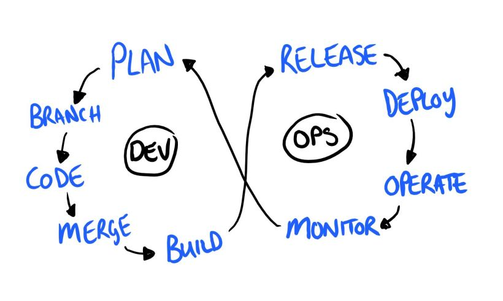
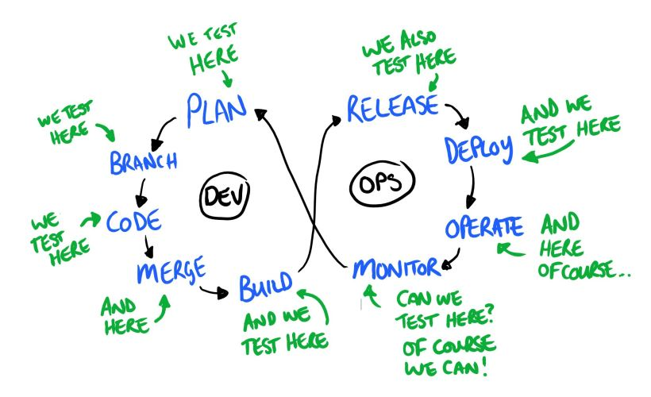

# devops Testing
* why test
* when ?
* what (should we test)
* how ?
* tdd
* focus on automated unit testing








## Why (unit) test (2) ?
* risks of failure
* risks of failure everywhere
* regressions
* 


## Why automate tests ?
* testing is important
* testing is repetitive 
* testing is boring
* automate !


## Different kind of tests
* unit tests
* integration tests
* performance test
* end to end (functional tests)
* a11y tests (axe)


## Unit test
* test an unit
* a function
* a class 
* isolated from the rest of the system


### unit test principles
* isolate
* simulate
* reproduce
* fake inputs
* verify outputs


## Integration test
* test several units
  * a group of components / service interactions
  * a full route from controller to db access.
  * a dac worker with several transformers
* still isolated


## Functional tests
* should verify the functional spec, not the code. 


# Practical examples


## Test structure
Example of unit test with jasmine or jest or mocha 
``` typescript
describe("MySuperComponent", () => {
    it("should do something", () => {
        // prepare
        const expectedValue = 42;
        const parameter = "osef";
        // execute the code
        const resultValue = callTheCode(parameter);
        // verify
        expect(resultValue).toBe(expectedValue)
    });
    it("should do another thing", () => {

    });
});
```


## Integration testing (protractor)

* protractor, uses a real browser
* goTo url
* verify page content/


## Performance testing

* Gatling or Artillery ?